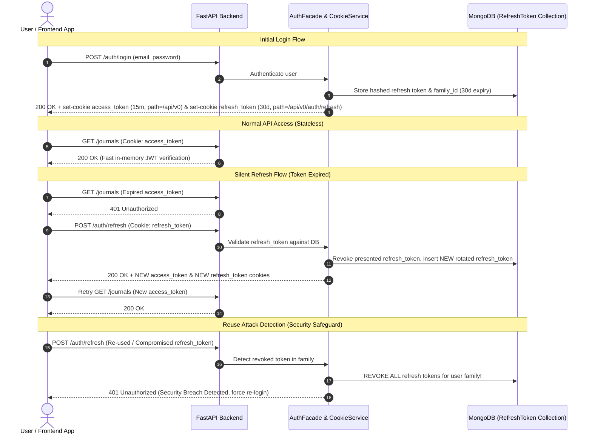

# Dual-Token Authentication Architecture

**My Inner Pages** uses a production-ready **Dual-Token Authentication Architecture** with **Refresh Token Rotation (RTR)**, **Reuse Attack Detection**, and **HttpOnly Cookie Storage**.

---

## 🏛️ Architecture Overview

The system uses two separate tokens with distinct lifetimes, storage mechanics, and security boundaries:

| Token | Type | Expiry | Storage Location | Cookie Scope Path | Access Level |
|---|---|---|---|---|---|
| **Access Token** (`access_token`) | Stateless JWT (`HS256`) | **15 minutes** | `HttpOnly` Cookie | `/api/v0` | Full API access |
| **Refresh Token** (`refresh_token`) | Secure Random String (SHA256 hashed) | **30 days** | MongoDB (`refresh_tokens` collection) & `HttpOnly` Cookie | `/api/v0/auth/refresh` | Token renewal only |
| **Session Indicator** (`session_exists`) | Plain string (`"1"`) | **30 days** | Client Cookie (JS Accessible) | `/` | Client-side UI state |

---

## 🔄 Interaction Flow & Sequence Diagram



---

## 🔐 Security Features

### 1. Narrow Cookie Path Scoping
To adhere to the principle of least privilege:
- `access_token` is sent on general API calls under `/api/v0`.
- `refresh_token` is restricted strictly to `/api/v0/auth/refresh`. It is **never sent** on normal API requests, eliminating cross-endpoint leakage risks.

### 2. Refresh Token Rotation (RTR)
Every time a refresh token is presented to `POST /auth/refresh`:
1. The backend validates the token.
2. The presented token is marked as `is_revoked = True`.
3. A brand-new refresh token is generated in the database under the same `family_id`.
4. The user receives fresh `access_token` and `refresh_token` cookies.

### 3. Reuse Attack Detection & Automatic Revocation
If an attacker steals a previously used refresh token and attempts to replay it:
1. The backend checks `token_doc.is_revoked`.
2. Because it was already rotated, `is_revoked` is `True`.
3. **Breach Protocol Triggered**: The backend immediately revokes **all refresh tokens belonging to that `family_id`**.
4. The legitimate user is logged out safely and prompted to re-authenticate.

### 4. Automatic Expiration via MongoDB TTL Index
`RefreshToken` documents in MongoDB feature a TTL index on `expires_at`:
```python
class RefreshToken(Document):
    user_id: PydanticObjectId
    token_hash: str
    family_id: str
    is_revoked: bool = False
    expires_at: datetime
    created_at: datetime

    class Settings:
        name = "refresh_tokens"
        indexes = [
            "token_hash",
            "user_id",
            "family_id",
            [("expires_at", 1)],  # MongoDB automatically deletes expired documents
        ]
```

---

## 💻 Frontend Concurrency-Safe Silent Refresh

In `frontend/src/utils/api.ts`, if multiple asynchronous requests receive `401 Unauthorized` simultaneously:
1. The first request acquires `isRefreshing = true` and invokes `authService.refreshToken()`.
2. Concurrent requests are queued into `refreshSubscribers`.
3. Upon successful refresh, all subscriber requests resume in parallel with the fresh cookies.
4. On refresh failure, `auth:expired` is dispatched to redirect the user to login.

---

## 📱 Active User Session & Device Management

Users can view and manage their active login sessions across devices from **Settings -> Active Devices & Sessions**:

- **Metadata Tracking**: Captures browser and OS details (parsed from `User-Agent`), IP address, and `last_used_at` timestamp.
- **Endpoints**:
  - `GET /api/v0/auth/sessions`: List active device session families, flagging `is_current`.
  - `DELETE /api/v0/auth/sessions/{family_id}`: Remotely revoke a specific session family.
  - `POST /api/v0/auth/sessions/revoke-others`: Revoke all active sessions except the user's current session.
- **UI Component**: [ActiveSessionsCard.tsx](file:///home/ali/Projects/my-projects/inner-pages/my-inner-pages/frontend/src/components/settings/ActiveSessionsCard.tsx) renders device icons, current device badge, and single-click revocation buttons.
